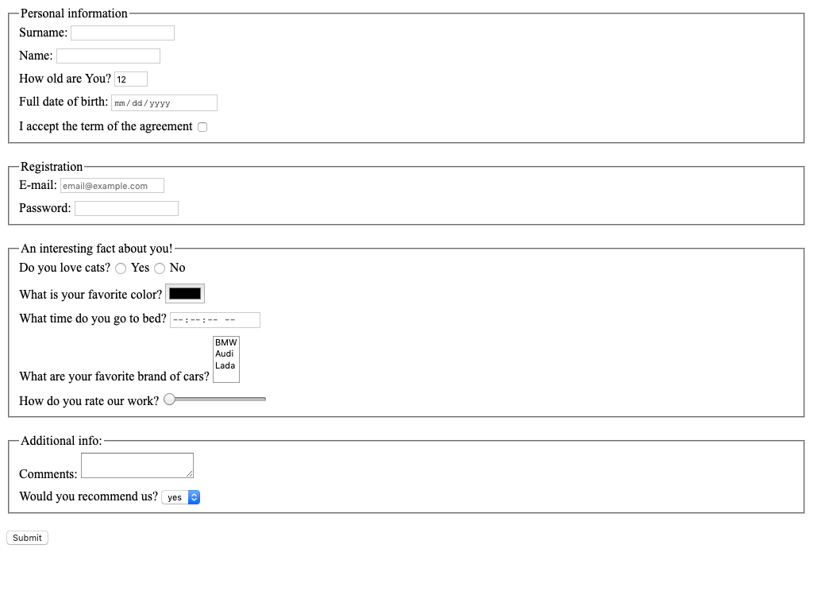

# html-form-task

Create HTML page with form.

## Notes
- Every field should have name attribute
- Every field should have label, which focuses input on label click
- Do not use tabs for indentation. Instead use 2 spaces
- Most of the time you want each tag in new line
- Form should have different inputs with such types:
  - [ ] text
  - [ ] number
  - [ ] email
  - [ ] checkbox
  - [ ] radio
  - [ ] password
  - [ ] range
  - [ ] time
  - [ ] color
  - [ ] date
- Form should have textarea and select elements.
- You should use each of this attribute at least once
  - [ ] required
  - [ ] min
  - [ ] max
  - [ ] minlength
  - [ ] maxlength
  - [ ] multiple
- Age should be at least `1` and at max `100` with a default value of `12`
- The email field should have placeholder value: `email@example.com`.
- Text fields should have `autocomplete="off"`.
- `Submit` button should have a `type="submit"` 
- Vertical distance between inputs should be `10px`
- Vertical distance between groups should be `20px`
- Any other styles should be browser default

## Tips & Hints
1. You can group fields with [fieldset](https://developer.mozilla.org/en-US/docs/Web/HTML/Element/fieldset) tag
2. The form should have correct `method` and `action`
